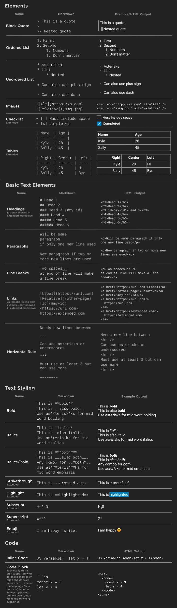
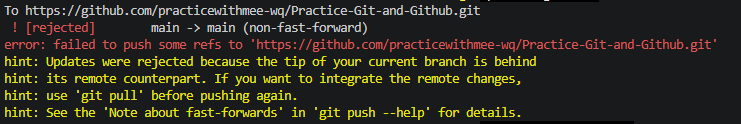

#  **Practice-Git-and-Github**
## **Installation**

1. Download the latest version from [git](https://git-scm.com).
2. Git installation [Video](https://www.youtube.com/watch?v=Kx1titsO57Q).
3. After installation, open Git Bash or Command Prompt and run: `git --version`
4. Create Acount and login.

## **Configration Levels**
Command use in git terminal.    
Git stores settings in three different locations depending on the desired scope:

- **System**   `--system`  For all users on the computer.
- **Global**   `--global`  Specific to you as a user.
- **Local**    `--local`   Specific to one repository (default).

## **Configration Git**
1. Set Username
`git config --global user.name "Your Name"`
2. Set Email
`git config -- global user.email "Yourmail@gnail.com"`
3. check Configuration
`git config --list`
4. Set Vs code as Default Editor
`git config --global core.editor "code --wait"`

- **Extra Configuration**
```
git config --global core.autocrlf ture
git config --global core.autocrlf input
git config --global core.autocrlf false
git config --global -e
```

## **Clone And Status**
command use in vs code terminal
- Clone: Cloning a repository on our local machine
    `git clone <- some link ->`
- Status: Displays the state of the code
    `git status`

- Untracked: new file that git doesn't yet track    
    Untracked files:    
  (use "git add <file>..." to include in what will be committed)

- Modified: changed  
    Changes not staged for commit:  
  (use "git add <file>..." to update what will be committed)    
  (use "git restore <file>..." to discard changes in working directory)      
        modified:   README.md
- Staged: file is ready to be commited
- Unmodified: unchanged 

## **Add And Commit**
- Add: adds new or changed files in your working directory to the git staging area.
    `git add <- file name ->`

- commit: it is the record of change
    `git commit -m "some message"`

## **Push command**
- Push: upload local repo content to remote repo
    `git push origin main`

## **Create a New Repo on the command line**
- `git init`  
- `git add < file name >`    (ex:- git add README.md)     
- `git commit -m "first commit"`  
- `git remote add origin <- line ->`  (github repo link)  
- `git remote -v`     (to verify remote)     
- `git branch -M main`    (to rename branch)  
- `git push origin main`  or  `git push -u origin main`

## **Useful Log Commands**
- view the commit history of a Git repository. `git log` 
- Last two commit with diff. `git log -p -2`  
- Summary of changes. `git log --stat`
- commit history is shown on a single line. `git log --pretty=oneline`
- search commit msg. `git log --grep="fix bug"`
- displays a customized, single-line history of your commits. `git log --pretty=format:"%h - %an, %ar : %s"`
- specific author. `git log --author="username"`
- After a specified date or time. `git log --since="YYYY-MM-DD"`
- occurred before or on a specific date/time `git log --until="YYYY-MM-DD"`

## **Git Restore And Reset**
- Case1. To undo changes, get the last successful change    
    `git restore .` or file name ( . mean all files).
- Case2: If we added the changes using git add then..   
    `git restore --staged <file_path>` (To unstage)     
    `git restore <file_path>`  (To discard changes in the working directory).
- Case3: Added changes to staging area (didn't commit) after this added more changes to file.    
    `git restore --worktree <File name>` (To get the staged changes).
- Case4: How about if we did commit also wrong files.   
    `git reset --soft HEAD^` (uncommit and Keep the changes).    
    `git reset --hard HEAD^` (uncommit and discard the changes).

## **Git Branching And Merging**
- `git branch` (to check branch).
- `git branch <name>` (create branch).
- `git checkout <branchname>` (switched to branch).
- `git merge <brandname>` (combine changes from one branch into another).

## **Git Clean And Tags**
- `git clean -n` (Shows you exactly what would be deleted without actually removing anything).
- `git clean -f` (Required to actually delete the untracked files).
- `git clean -fd` (Deletes untracked directories as well as files).
- `git clean -fx` (Deletes untracked files AND files ignored by your .gitignore).
- `git tag -a v1 -m "message"` (To create annotated tags).  
- `git show v1` (To show tags data).    
- `git tag -a v1 <commit_no>` (To tag old commit in case you forgot).   
- `git tag -d <tag_no>` (To delete a tag).  
- `git push origin <tag_no>` .   
- `git push origin --tags` (For all tags together).

## **Markdown Cheat Sheet**


## **Errors**
**Case1.**
**Method1.**
```
gir fetch origin main:tmp    
git add .     
git push origin main
```
**Method2.**
```
git pull --rebase origin main
git push origin main
```
